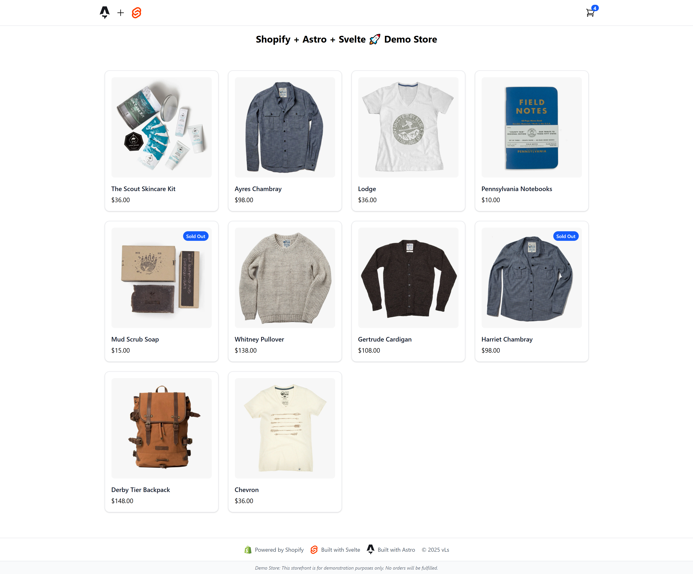

# 🛒 Shopify Headless Starter

A lightweight, modern starter kit built with **Astro + Svelte** and powered by the **Shopify Storefront API**. Designed for speed, clarity, and full creative control — ideal for developers building performant headless storefronts with minimal setup.

## 🌍 Live Demo

[https://shopify-headless-demo.netlify.app](https://shopify-headless-demo.netlify.app)  
[](https://app.netlify.com/projects/shopify-headless-demo/deploys)

---

## ✨ Features

- ⚡️ Fast, SSR-ready setup with Astro and Svelte
- 🛍 Product listing and dynamic detail pages
- 🎛 Variant selection with inventory safeguards
- 🛒 Cart with Shopify-native state persistence
- 💵 Utilities for money, images, and formatting
- 🌐 Typed API requests (Shopify Storefront API 2025-07)

---

## 🧱 Tech Stack

- [Astro](https://astro.build/)
- [Svelte](https://svelte.dev/)
- [Shopify Storefront API](https://shopify.dev/docs/api/storefront)
- TypeScript
- Tailwind CSS (optional, plug in as needed)

---

## 📸 Preview



## 🚀 Quick Start

1. **Clone the repo**

```bash
   git clone https://github.com/LivexTwin/shopify-headless-demo
   cd shopify-headless-demo
```

2. **Set up environment variables**

   ```
   cp .env.example .env
   ```

   `.env` file must include:

   ```
   PUBLIC_SHOPIFY_DOMAIN=your-store.myshopify.com
   PUBLIC_SHOPIFY_TOKEN=your-storefront-api-token
   ```

3. **Install Dependencies**

```
npm install
```

4. **Start the development server**

```
npm run dev
```

## 📁 Project Structure

shopify-headless-demo/
├── public/ # Static assets (favicons, SEO images, etc.)
├── src/
│ ├── components/ # Svelte components (Cart, ProductCard, etc.)
│ ├── layouts/ # Page layouts
│ ├── pages/ # Astro pages and route definitions
│ ├── styles/ # Global styles
│ ├── utils/ # Currency, image formatting, helpers
│ └── lib/ # Shopify API client logic
├── .env.example # Template for environment variables
├── README.md
└── package.json

## 💡 Notes

This starter is intentionally minimal — no heavy UI libraries or styling decisions baked in. It's meant to be a foundation you can shape into a unique, performant eCommerce experience.

This project generates a fully static site by default, so no server adapter is included. Deploy easily on Netlify, Vercel, or any static hosting platform.

For advanced use cases (like server-side rendering, serverless functions, or on-demand rendering), you can add a platform-specific adapter such as `@astrojs/netlify` or `@astrojs/vercel` as needed.

### Quick Usage Example

Here's a minimal example of how to fetch product data using the built-in Shopify client and display product titles in an Astro page:

```
---
import { shopifyFetch } from '../lib/shopify.js';
import { GET_PRODUCTS } from '../lib/queries/products.ts';

const data = await shopifyFetch(GET_PRODUCTS);
const products = data.products;
---

<ul>
  {products.map(product => (
    <li>{product.title}</li>
  ))}
</ul>

```

This example shows how to use the reusable GraphQL query from `lib/queries/products.ts` and the client in `lib/shopify.ts` to fetch and render products on a page.

---

## 🧪 API Version

Built using Shopify Storefront API `v2025-07`.  
→ [View official docs](https://shopify.dev/docs/api/storefront)

---

## 🛠️ License

This project is open-source under the [MIT License](./LICENSE).

---

Made with ❤️ by [Anthony](https://github.com/livextwin)
[](https://astro.build)
